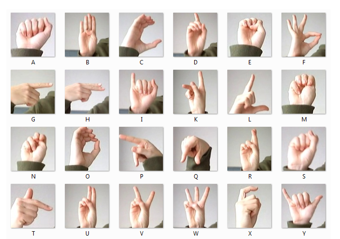
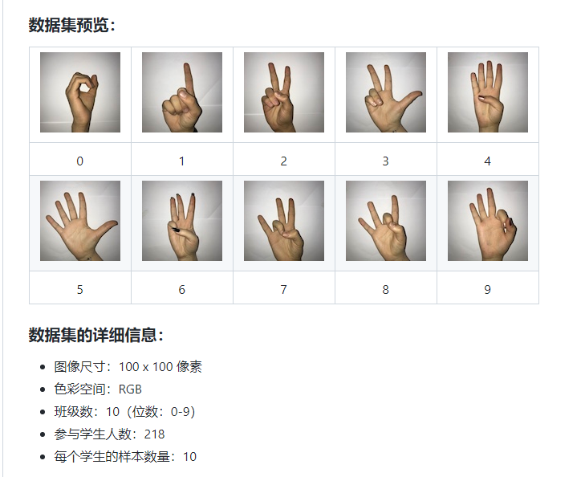
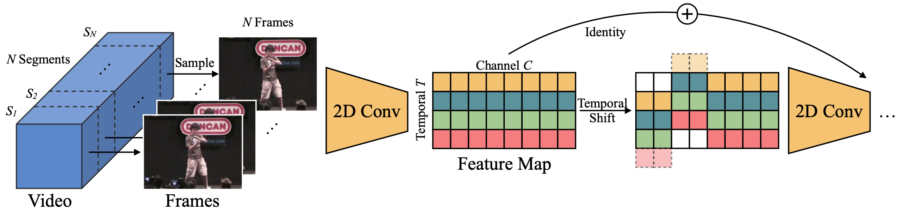
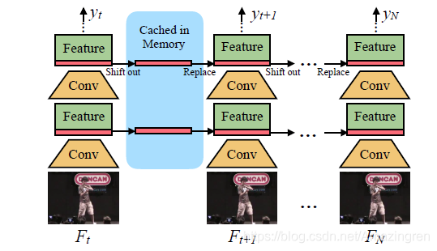
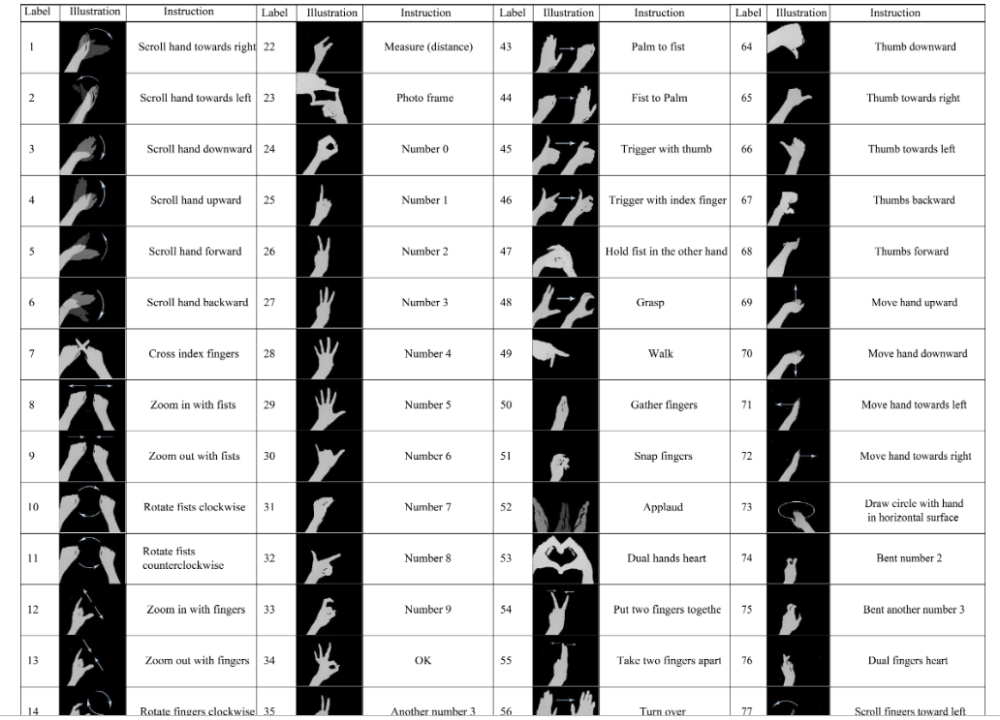
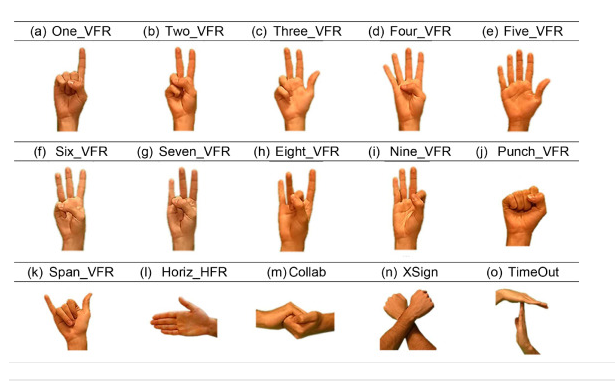
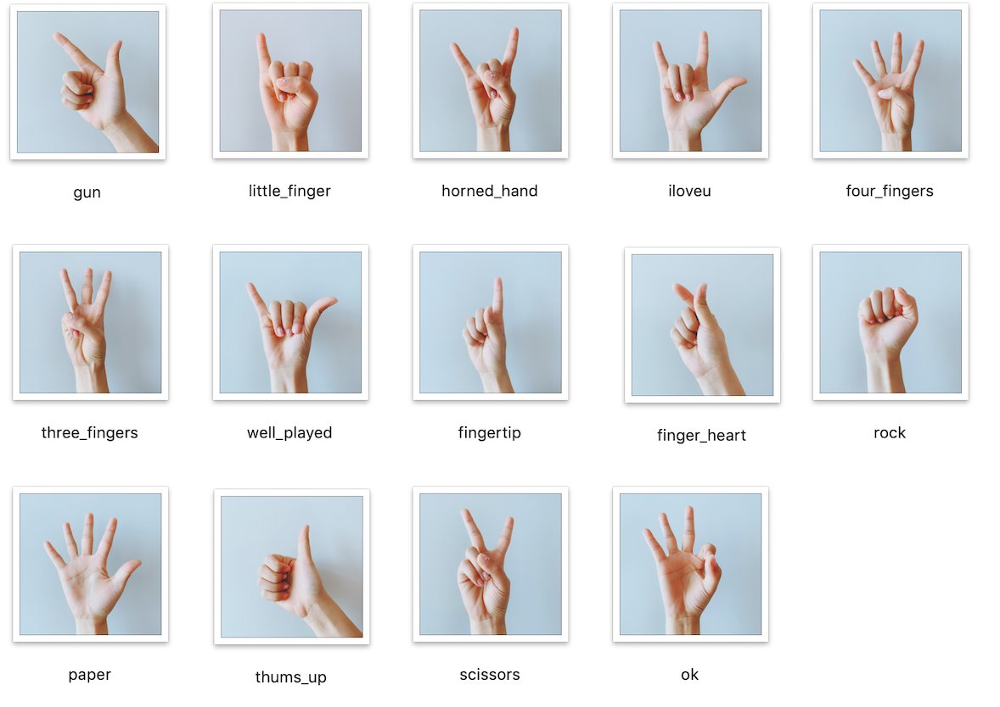

# 手势识别调查文档

## 1.手语数据集，主要包含是[字母 A-Z](https://www.kaggle.com/datamunge/sign-language-mnist) 和[数字 0-9](https://www.kaggle.com/ardamavi/sign-language-digits-dataset),图像如下：

+ 识别这种手势的数据集，先采用检测手，然后采用分类的方法来实现。

## 2.[EgoGesture](http://www.nlpr.ia.ac.cn/iva/yfzhang/datasets/egogesture.html) 和 [NVIDIA](https://research.nvidia.com/publication/online-detection-and-classification-dynamic-hand-gestures-recurrent-3d-convolutional) 动态手势数据集,其中EgoGesture数据集需要下载协议，NVIDIA数据集可以直接下载。[所用的方法](https://blog.csdn.net/gaoqing_dream163/article/details/123661391)

### 2.1 视频分类一般的做法如下：
+ 1.第一种方法是通过将视频的每一帧视为一幅单独的图像，利用二维 CNN 进行处理。这种方法将视频分类问题简化为图像分类问题。每帧视频图像都有类别输出，并且根据各帧输出的类别，选择频率最高的类别作为视频的分类结果。
+ 2.第二种方法是创建一个单一的网络，将二维 CNN 与一个 RNN 结合在一起。这个想法是，CNN 将考虑到图像分量，而 RNN 将考虑每个视频的序列信息。这种类型的网络可能非常难以训练，因为要优化的参数数量非常大。
+ 3.第三种方法是使用三维卷积网络，其中三维卷积网络是二维 CNN 的在 3D 张量（时间，图像宽度，图像高度）上运行的扩展。这种方法是图像分类的另一个自然延伸，但三维卷积网络可能很难训练。
+ 4.第四种方法基于智能方法的直觉。它们可以用于存储视频中每个帧的离线功能，而不是直接使用 CNN 进行分类。这个想法基于，特征提取可以非常有效地进行迁移学习，如前面章节所示。在提取所有的特征之后，可以将它们作为一组输入传递给RNN，其将在多个帧中学习序列并输出最终的分类。
+ 5.第五种方法是第四种方法的简单变体，其中最后一层是 MLP 而不是 RNN。在某些情况下，就计算需求而言，这种方法可以更简单并且成本更低。
+ 6.第六种方法也是第四种方法的变体，其中特征提取阶段采用三维 CNN 来提取空间和视觉特征，然后将这些特征传递给 RNN 或 MLP
+ 前三种方法通常计算量更大，而后三种方法计算成本更低，而且性能更好。

### 2.2 TSM动态手势检测
+ 1.2DCNN的局限性：仅仅利用单独的frames,因此并不能对时序信息进行很好的建模
+ 2.3DCNN的局限性：尽管可以学习到时空信息，但是运算量巨大，使得应用困难
+ 3.在时间维度上，移动了帧与帧之间的一些channel，因此使得帧间的信息得到了交换
+ 4.[该方法检测流程如下](https://blog.csdn.net/Amazingren/article/details/100715768#:~:text=TSM%3A%20Temporal%20Shift%20Module%20for%20Efficient,Video%20Understanding%20%28ICCV2019%29%20%E8%BF%99%E6%98%AF%E4%B8%80%E7%AF%87%E5%85%B3%E4%BA%8E%E8%A7%86%E9%A2%91%E7%90%86%E8%A7%A3%E7%9A%84%E6%96%87%E7%AB%A0%EF%BC%8C%E4%B8%BB%E8%A6%81%E4%BB%8B%E7%BB%8D%E4%BA%86%E4%B8%80%E7%A7%8D%E5%8F%AF%E4%BB%A5%E8%BE%BE%E5%88%B03DCNN%E7%9A%84%E6%95%88%E6%9E%9C%E7%9A%84%EF%BC%8C%E4%BD%86%E6%98%AF%E4%BF%9D%E6%8C%812DCNN%E8%AE%A1%E7%AE%97%E9%87%8F%E5%92%8C%E5%8F%82%E6%95%B0%E9%87%8F%E7%9A%84%E6%96%B9%E6%B3%95%EF%BC%8C%E5%8F%AB%E5%81%9ATSM%EF%BC%88Tempora%20Shift%20Module%EF%BC%89%E4%B9%9F%E5%B0%B1%E6%98%AF%E5%9C%A8%E4%B8%80%E7%B0%87%E8%A6%81%E5%A4%84%E7%90%86%E7%9A%84%E5%B8%A7%E4%B9%8B%E9%97%B4%EF%BC%8C%E6%8A%8A%E7%9B%B8%E9%82%BB%E5%B8%A7%E4%B9%8B%E9%97%B4%E7%9A%84channel%E8%BF%9B%E8%A1%8C%E4%BA%86%E4%BA%A4%E6%9B%BF%E6%8B%BC%E6%8E%A5%EF%BC%81):

+ 5.Online的单向TSM模型
方式：把之前的frames shifts到当前的frames上，从而也达到了时序信息建模的作用，从而实现在线的recognition功能！
推理图如下：在推理的过程中，对于每一帧（比如Ft），只保存其首先的1/8的feature map。并且保存在cache中，对于下一帧(比如F t+1 ), 那么就是用Ft上的保存的1/8和当前帧Ft+1上的7/8组合起来。从而生成下一层feature map。如此循环下去！ 该模型使用 MobileNetV2 作为主干，并插入了在线 TSM。它是用TVM编译的。它可以在 Nano 上以超过 70 FPS 的速度运行（对于演示，速度被相机延迟）。

## 3.[Mendeley data](https://data.mendeley.com/datasets/ndrczc35bt/1),数据可以下载，解压出错。该数据集根据介绍是有手的框还有手的类别。可以识别手势如下：

## 3.[商汤科技手势识别](http://openar.sensetime.com/docs)现在主要目前可识别14中常用的手势，包括剪刀，石头，布，OK，点赞，666，手枪，比心，我爱你，三根手指，四根手指，小拇指，指尖，金属礼。

## 4.[百度手势识别](https://ai.baidu.com/tech/body/gesture)目前识别24种常见手势，支持单手手势和双手手势，包括拳头、OK、比心、作揖、作别、祈祷、我爱你、点赞、Diss、Rock、竖中指、数字等。

